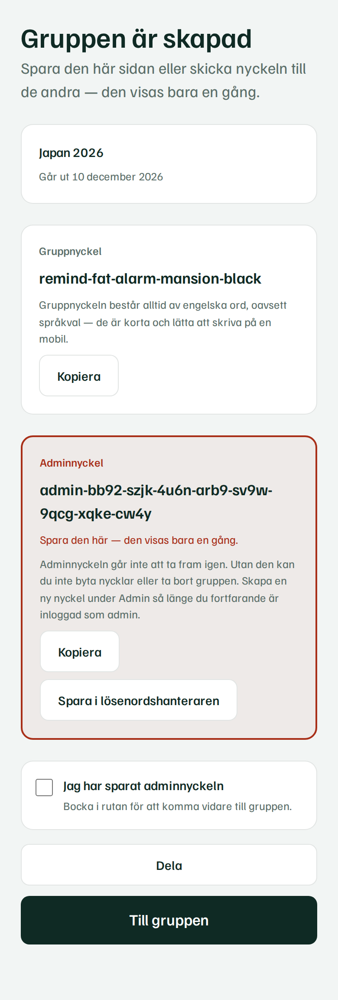
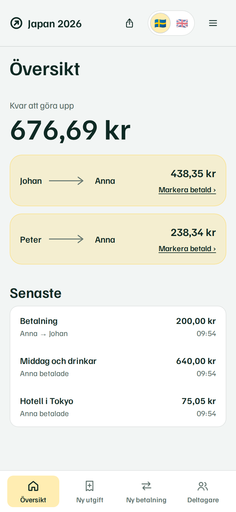
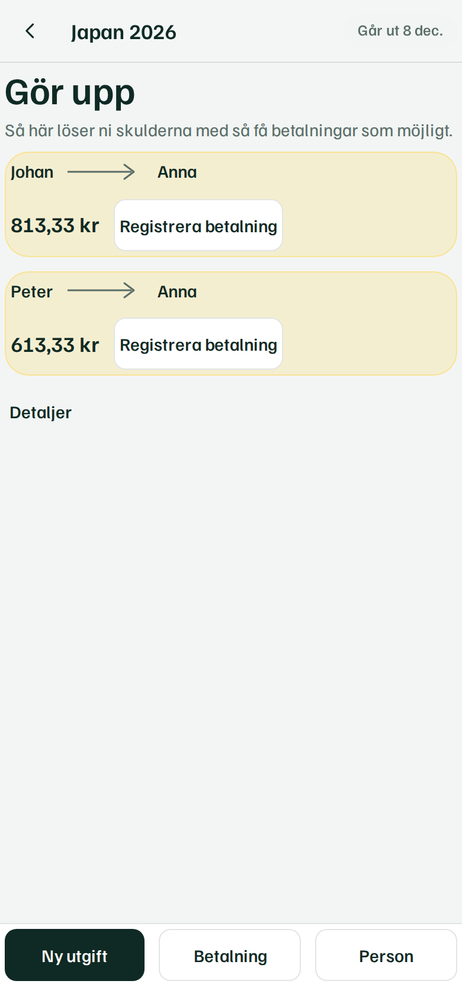
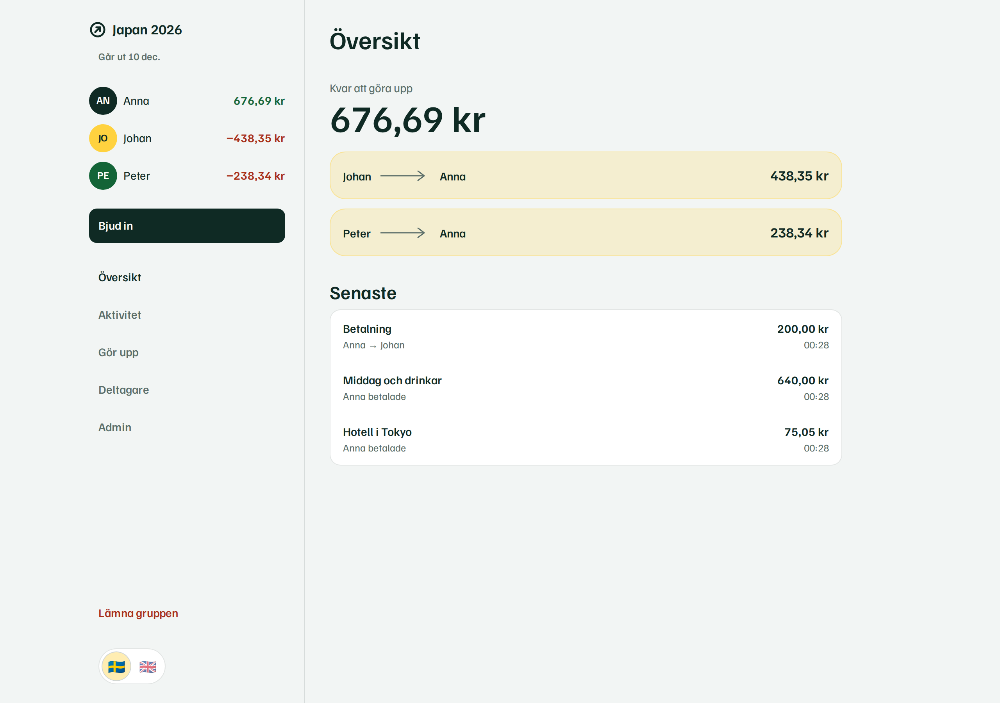

# Skyldig

Skyldig ("owing" in Swedish) is an account-less, self-hosted web app for splitting shared
expenses within a group. There is no signup and no login: a group ("session") is identified by a
five-word English access phrase that you share with the people in it. Anyone with the phrase can
add expenses and repayments and see who should pay whom. Groups are temporary and disappear on
their own.

How it works:

- Create a group: give it a name, a base currency, and the participants.
- Share the five-word access phrase with the group (and keep the one-time admin key for yourself).
  The phrase is always English words, whatever language the interface is in — they are short
  and quick to type on a phone.
- Everyone with the phrase adds expenses (who paid, how much, split between whom) and repayments.
- The app computes a settlement plan: the shortest list of "X pays Y this much" transfers that
  clears every balance.
- The group and all its data expire and are deleted 90 days after creation, whether or not anyone
  visits.

The interface is available in Swedish and English (the access phrase itself is always English
words, regardless of interface language — they are short and quick to type on a phone). See `docs/design.md` for the visual direction and
`docs/architecture.md`
for the full architecture decision record — this README summarizes and links to it rather than
repeating it.

## Status

The MVP is complete and verified end to end. What works today:

- Create a group, share a five-word English access phrase, join from another browser.
- Invite people with a single-use QR code or link instead of dictating the phrase; the phrase
  itself never travels in a URL. An invite link is redeemable once, for 24 hours, and is
  retired early if the access phrase is rotated.
- A separate admin key unlocks rotating either key and deleting the group. It is shown once,
  behind a required "I have saved the admin key" acknowledgement, and is stored only as a
  peppered HMAC — so it cannot be recovered. While still elevated, an admin can mint a
  replacement key from the admin page; the old one stops working immediately.
- Participants, expenses and repayments with edit, delete and full revision history.
- Multiple currencies with a user-entered exchange rate locked to each transaction.
- Balances and a settlement plan that says who should pay whom.
- Groups expire 90 days after creation, removed by a background job.
- Swedish and English interface, mobile first, with an in-app usage guide at `/guide`.

Verification, all currently passing:

| Check | Result |
|---|---|
| Unit and integration tests | 277 across 29 files |
| End-to-end tests (Playwright) | 20, covering the full 12-step flow |
| Accessibility (axe, serious/critical) | 0 violations across 11 pages |
| Lint and type checking | clean |

Two independent reviews were run against a live instance. Financial correctness was
fuzzed through the real database: 360 randomized groups, 6,717 mutations and 340,619
assertions, plus 3.4 million settlement assertions, with no failures. The security review
found no exploitable authorization, injection or cross-site defect; its findings have been
fixed.

Docker deployment has been exercised on a real self-hosted server as of v0.2.1: the
published image runs behind a reverse proxy alongside another site, applies its own
migrations at startup and serves traffic. Note that v0.1.0-v0.2.0 images are unusable
(see the v0.2.1 release notes); use v0.2.1 or later.

Known open items are tracked in [docs/todo.md](docs/todo.md).

## Quick start (no Docker)

The project uses an embedded PostgreSQL binary (`embedded-postgres`) for local development, so
you do not need a system Postgres install or Docker to run it.

```sh
pnpm install
cp .env.example .env
# generate a pepper and put it in .env as ACCESS_KEY_PEPPER
openssl rand -base64 48
pnpm dev:db      # starts embedded Postgres on localhost:5432, matches .env.example, Ctrl-C to stop
pnpm db:migrate  # in another terminal: applies drizzle/*.sql to that database
pnpm dev         # starts the dev server (reads DATABASE_URL etc. from .env)
```

`pnpm dev:db` (`scripts/dev-db.ts`) initializes (first run only) and starts a persistent embedded
Postgres instance under `.pg-embedded/dev`, with user/password/db all `skyldig` — matching the
`DATABASE_URL` already in `.env.example`. Leave it running in its own terminal.

If you skip setting `ACCESS_KEY_PEPPER`, the app falls back to a fixed, publicly-known dev-only
value in non-production environments and prints a warning; it refuses to start in production
without one (see the Environment variables section).

## Quick start (Docker)

```sh
cp .env.example .env   # fill in ACCESS_KEY_PEPPER at minimum
docker compose up -d
```

This pulls the published `ru551n/skyldig` image. Set `SKYLDIG_TAG` in `.env` to pin a
release (e.g. `SKYLDIG_TAG=v0.2.1`) instead of tracking `latest`. To build from a source
checkout instead of pulling:

```sh
docker compose -f compose.yaml -f compose.build.yaml up -d --build
```

This has not been exercised on the development machine, but is what `compose.yaml` and the
`Dockerfile` implement:

- `db`: `postgres:17-alpine`, credentials from `POSTGRES_USER`/`POSTGRES_PASSWORD`/`POSTGRES_DB`
  (defaulting to `skyldig`/`skyldig`/`skyldig`), data in the named volume `skyldig-pgdata`, health
  is `pg_isready`.
- `app`: built from the multi-stage `Dockerfile` (deps → build → runtime on `node:24-alpine`,
  runs as the non-root `node` user), reads `.env` plus a `DATABASE_URL` pointed at the `db`
  service, only starts once `db` reports healthy, and exposes `/health` as its own
  `HEALTHCHECK`. Published on host port `PORT` (default `3000`).
- Migrations run automatically: `server.js` (the production entry point) runs
  `server/db/migrate.ts` before starting the HTTP server, so there is no separate migrate step
  in Docker.
- Data lives entirely in the `skyldig-pgdata` Docker volume; nothing is persisted in the app
  container itself.

## Environment variables

Read and validated in `server/config.ts`.

| Variable | Required? | Default | Purpose |
|---|---|---|---|
| `DATABASE_URL` | Yes | — | Postgres connection string. |
| `ACCESS_KEY_PEPPER` | Yes in production (≥ 32 chars); optional in dev/test | Fixed dev-only value (dev/test only) | Server-side secret keying every access-phrase and admin-key hash: the HMAC-SHA256 lookup index, the admin-key HMAC, and the scrypt verifier input (`scrypt2` format; verifiers from before that format hashed the bare phrase and are re-hashed on the next successful join). Never store this in the database or in a database backup — a backup taken without it is fine, but if the pepper itself is lost, every existing access phrase and admin key becomes unverifiable and every group becomes permanently inaccessible. |
| `PORT` | No | `3000` | HTTP port the server listens on. |
| `PUBLIC_ORIGIN` | No | `http://localhost:3000` | The externally-visible origin, used for CSRF origin checks, invite links, and the canonical URLs, sitemap, `robots.txt` and link-share previews search engines and chat apps see. Must exactly match what users' browsers see in production. |
| `TRUST_PROXY` | No | unset (not trusted) | How many reverse proxies in front of the app to trust for `X-Forwarded-For` (client IP for rate limiting). `1` (or `true`) for one proxy, `2` for e.g. CDN → nginx → app; or a comma-separated list of `loopback`, `linklocal`, `uniquelocal`, IPs or CIDRs (`loopback,10.0.0.0/8`). Never trusts every hop; an invalid value fails startup. |
| `COOKIE_SECURE` | No | `true` if `NODE_ENV=production`, else `false` | Forces the `Secure` attribute on the session cookie on or off, overriding the `NODE_ENV`-based default. |
| `ADMIN_ELEVATION_TTL_MINUTES` | No | `30` | How long an admin elevation (admin key entered on the group's admin page, or the creator's initial grant) stays effective before the browser session drops back to plain member and must re-enter the admin key. Integer 1–1440; membership is unaffected. |
| `LOG_LEVEL` | No | `info` | pino log level (`fatal`\|`error`\|`warn`\|`info`\|`debug`\|`trace`\|`silent`). |
| `NODE_ENV` | No | `development` | `development`\|`production`\|`test`. Also gates the `ACCESS_KEY_PEPPER` requirement and the `COOKIE_SECURE` default. |
| `POSTGRES_USER`, `POSTGRES_PASSWORD`, `POSTGRES_DB` | No (Docker only) | `skyldig`/`skyldig`/`skyldig` | Used by `compose.yaml` to configure the `skyldig-db` service and as the superuser for the `skyldig-db-setup` step (and for the app's `DATABASE_URL` until `APP_DB_*` are set); not read by the application code itself. |
| `APP_DB_USER`, `APP_DB_PASSWORD` | No (Docker only), recommended | unset | A database role of the app's own, e.g. `skyldig_app`. Set both: `skyldig-db-setup` creates it and hands it the app's tables, and the app connects as it instead of the superuser. See [Database roles](#database-roles). |
| `ADMIN_DB_PASSWORD` | Only for the admin app | unset | Password of the `skyldig_admin` database role, created by `skyldig-db-setup`. See [Admin app](#admin-app). |
| `ADMIN_PUBLIC_ORIGIN`, `ADMIN_TRUSTED_PROXY`, `ADMIN_REQUIRED_GROUP`, `ADMIN_PORT`, `ADMIN_TIMEZONE` | Only for the admin app | —, —, `skyldig-admins`, `3001`, `Europe/Stockholm` | See [Admin app](#admin-app). |

## Scripts

From `package.json`:

| Script | Does |
|---|---|
| `pnpm dev` | Starts the app in development mode (`node --conditions development server.js`). |
| `pnpm dev:db` | Starts a persistent embedded Postgres for local development (`scripts/dev-db.ts`). |
| `pnpm build` | Builds the production bundle (`react-router build`). |
| `pnpm start` | Runs the production server (`node server.js`); expects a built `build/` directory. |
| `pnpm typecheck` | Generates React Router types and runs `tsc -b`. |
| `pnpm lint` | Runs ESLint over the repo. |
| `pnpm format` / `pnpm format:check` | Prettier write / check. |
| `pnpm test` | Runs the full Vitest suite. |
| `pnpm test:unit` | Runs only the `unit` Vitest project (`domain/**`). |
| `pnpm test:integration` | Runs only the `integration` Vitest project (against embedded Postgres). |
| `pnpm db:generate` | Generates a new Drizzle SQL migration from schema changes (`drizzle-kit generate`). |
| `pnpm db:migrate` | Applies pending migrations in `drizzle/` to `DATABASE_URL` (`server/db/migrate.ts`). |
| `pnpm cleanup` | Runs the expiration cleanup job once and exits; for use from an external scheduler (`server/modules/expiration/cli.ts`). |
| `pnpm verify` | `lint` + `typecheck` + `test:unit` + `test:integration`, in that order. |

(Playwright e2e tests are run directly via `npx playwright test`, using `playwright.config.ts`,
which starts its own embedded Postgres and dev server — see `tests/e2e/`.)

## Architecture

Skyldig is a modular monolith running as a single Node process (Express 5 + React Router 8 in
framework/SSR mode). Three layers, enforced by ESLint import rules:

- `domain/` is pure TypeScript with zero runtime dependencies and no framework or I/O — money
  handling, currency conversion, splitting, balances, and settlement all live here and are
  covered by unit tests independent of the database or HTTP layer.
- `server/` is Node-only (config, logging, the Drizzle schema/client/migrations, and one module
  per concern: session, auth, participants, expenses, payments, audit, expiration, balances,
  plus the Express HTTP wiring) and is never imported from client-side code.
- `app/` is the React Router UI: route modules (loader/action/component), client-safe
  components, and the Swedish i18n catalog. Route modules only touch `server/**` inside their
  `loader`/`action` functions, which React Router strips from the client bundle.

```
skyldig/
  app/                    React Router app (client + SSR)
    routes/               route modules (loader/action/component)
    components/           ui/ primitives + feature components (client-safe only)
    i18n/                 sv.ts catalog, typed t(), useT()
    app.css               tailwind entry + design tokens
    root.tsx, routes.ts
  domain/                 PURE financial domain. Zero runtime deps. No framework, no DB, no I/O.
    money/                minor units, parse/format, rounding helpers
    currency/             ISO currency registry (decimals), rational exchange rates, conversion
    split/                largest-remainder split (weights; MVP uses equal weights)
    balances/             net balance per participant in base currency
    settlement/           settlement simplification
  server/                 Node-only. Never imported from app/components.
    config.ts, logger.ts
    db/                   drizzle schema, client, migrate.ts
    modules/session, auth, participants, expenses, payments, audit, expiration, balances
    http/                 express app, health endpoints, security headers
  server.js               production entry (express + migrations + cleanup job)
  drizzle/                SQL migrations
  tests/integration       Vitest against embedded Postgres
  tests/e2e               Playwright
  scripts/                wordlist check, helpers
  docs/
  Dockerfile, compose.yaml, .env.example
```

See `docs/architecture.md` for the full decision record, including the credential design, data
model, and rejected alternatives.

## Financial model

All money is stored and computed as integer minor units (e.g. öre, cents) — `bigint` in
TypeScript, `bigint`/`int8` in Postgres, decimal strings over the wire — never as floating point,
so rounding error cannot silently accumulate. Amounts are capped at 10^15 minor units, and SQL
never multiplies money: conversion and splitting always happen in TypeScript using exact `bigint`
arithmetic; the database only sums already-computed values.

Splitting an expense uses the largest-remainder (Hamilton) method: each participant's floor share
is computed, and the leftover minor units (the total minus the sum of the floors) are handed out
one each, in a fixed deterministic order, to the participants with the largest fractional
remainders. This guarantees the shares always sum exactly to the original amount — no money is
created or destroyed by rounding — and that no participant's share differs from any other's by
more than one minor unit for an equal split.

Each session has one fixed base currency. An expense or payment entered in a different currency
stores three things: the amount and currency code as entered, the exchange rate exactly as the
user typed it (both as free text and as an exact `rate_num/rate_den` fraction), and the resulting
base-currency amount computed at write time. That base-currency amount is locked in — it is only
ever recomputed if a user later edits the amount or the rate on that specific transaction, never
because market rates moved. This means historical transactions never silently reprice themselves,
and every settlement is always computed purely from these locked base-currency values.

Settlement takes each participant's net balance in the base currency (what they paid or were
owed, minus their share of expenses, plus or minus repayments) and produces the shortest list of
"A pays B" transfers that zeroes every balance: an exact-match pass pairs debtors and creditors
whose amounts happen to coincide, then a greedy pass repeatedly matches the largest remaining
debtor with the largest remaining creditor. The result is deterministic, uses at most
participants − 1 transfers, and is recomputed on demand rather than stored — it's presented as a
suggestion, since adding one more expense can reshape the whole plan.

## Security

The access phrase is the sole credential for reading or editing a group — anyone who has it can
see and change everything in that group. It is five words from the 2048-word BIP-39
English wordlist (vendored into the repo), giving exactly 55 bits of entropy. Phrases are
generated in English regardless of the interface language. Groups created before that change
have Swedish phrases, and groups created before the change to five words have four-word
phrases (~44 bits); both keep working until they expire or the phrase is rotated, because
verification never checks the wordlist or the word count. It is never stored in plaintext: the database
holds an HMAC-SHA256 blind index (keyed by `ACCESS_KEY_PEPPER`) for lookup, plus a separate
scrypt verifier (also keyed by the pepper, so a database dump alone reveals nothing) checked with
a timing-safe comparison. A dump *together with* the pepper does let an attacker guess phrases
offline at HMAC speed (a 5-word phrase is on the order of a GPU-month), which is why the pepper
must live only in the environment — see docs/architecture.md §4.1. The admin key is a second, higher
privilege credential (20 random bytes, base32-encoded) needed for destructive actions (deleting
the session, rotating keys); it is shown once, only in the response to the create action, and
never logged or put in a URL.

Browser sessions use a random 32-byte token whose SHA-256 hash is what's stored server-side; the
token itself lives only in an `HttpOnly`, `SameSite=Lax` cookie (`__Host-` prefixed in
production). The token rotates on every privilege change (join, admin elevation, leave). Joining a
group and elevating to admin are both rate-limited per client and, for elevation, also per
session. Access phrases, admin keys, tokens, passwords, cookies, and authorization headers are
explicitly excluded from logs (pino `redact`); auth failure logs record only the client key and a
reason, never the credential attempted.

## Sessions and expiry

A session's `expires_at` is set once, to 90 days after creation, and is never extended by
activity. Every query that reads session data filters on `expires_at > now()` using the
database's own clock, so a session becomes unreadable the moment it expires even before it is
physically deleted. Deletion is a batched background job (`server/modules/expiration`) that runs
at process startup and then hourly, guarded by a Postgres advisory lock so only one instance acts
even if you run multiple replicas; it deletes expired sessions and their expired browser sessions
in batches of 200 regardless of whether anyone visits. The same job can be triggered on demand
with `pnpm cleanup`, for use with an external scheduler instead of (or in addition to) the
in-process timer.

## Tests

Three layers, matching the Vitest projects and the Playwright config:

```sh
pnpm test:unit          # domain/** — pure logic: money, currency/rates, split, balances, settlement
pnpm test:integration   # server modules against a real database
pnpm verify             # lint + typecheck + unit + integration, in order
npx playwright test     # end-to-end browser flow (tests/e2e)
```

Integration tests start their own PostgreSQL: `tests/integration/global-setup.ts` boots an
`embedded-postgres` instance (unless `TEST_DATABASE_URL` is already set, in which case it uses
that instead), runs the real migrations against it, and provides the connection string to every
test file — no separate database setup is needed to run `pnpm test:integration` locally or in CI.
Playwright's config does the same for the e2e run.

## Production notes

Run the app behind a reverse proxy that terminates TLS. Set `PUBLIC_ORIGIN` to the exact external
origin (used for CSRF checks — a mismatch will reject legitimate requests), set `TRUST_PROXY` to
the number of proxies in front of the app (`1` for a single nginx/Caddy/Traefik) so rate limiting
sees the real client IP rather than the proxy's, and set `COOKIE_SECURE` explicitly if your setup
doesn't match the `NODE_ENV`-based default. Make sure that proxy overwrites or appends to
`X-Forwarded-For` (all mainstream ones do) — never trust more hops than you actually run, or
clients can pick their own rate-limit identity.

Rate limits live in the app process's memory, not in the database. Run a single instance: every
replica you add multiplies every limit (join, invite, group creation, admin elevation) by the
replica count and lets a client spread attempts across replicas. If you must run replicas, add a
coarse limit at the reverse proxy as well (e.g. nginx `limit_req` on the `POST` routes) so the
aggregate stays bounded — see docs/architecture.md §4.4.

For backups, dump the Postgres database (session, participant, expense, payment, and revision
data all live there) on your normal schedule. `ACCESS_KEY_PEPPER` must **not** be included in
that dump or stored alongside it — it lives only in the environment. Keep it in a separate secret
store with its own backup/rotation process; if it is lost, every access phrase and admin key in
every existing group becomes unverifiable, which is equivalent to losing every group. If it leaks
together with a dump, treat every access phrase as compromised (see docs/architecture.md §4.1).

Logs are structured JSON (pino), pretty-printed in development, and already redact cookies,
authorization headers, and any field named `phrase`, `adminKey`, `token`, or `password`. Ship them
to your normal log pipeline; nothing else in the app writes credentials to stdout.

### Publishing a release image

`.github/workflows/docker-release.yml` builds the production image (`linux/amd64` and
`linux/arm64`) and pushes it to Docker Hub as `ru551n/skyldig` whenever a GitHub Release is
published. A release tagged `v1.4.2` produces the image tags `1.4.2`, `1.4`, `1`, `latest`,
and `sha-<short commit>`; a pre-release tag produces only the exact-version and `sha-` tags,
never `latest`. It can also be run by hand from the Actions tab (`workflow_dispatch`) to
republish an existing tag, e.g. after a registry outage.

The workflow needs two repository secrets, under Settings → Secrets and variables → Actions:

| Secret | Value |
|---|---|
| `DOCKERHUB_USERNAME` | `ru551n` |
| `DOCKERHUB_TOKEN` | A Docker Hub [access token](https://docs.docker.com/security/for-developers/access-tokens/) with read/write scope, not the account password |

This workflow has not been run, since publishing a release is a repository-owner action; the
Dockerfile itself has been reviewed and its runtime file set verified to boot (see Status
above), but the actual `docker buildx build --platform linux/amd64,linux/arm64` has not been
executed on this machine, which has no Docker installed.

## Database roles

By default the official Postgres image makes `POSTGRES_USER` a superuser, and the app connected as
it. The app needs none of a superuser's powers (reading other databases, `COPY … TO PROGRAM`,
creating roles), so it can run as a role of its own: set `APP_DB_USER` (e.g. `skyldig_app`) and
`APP_DB_PASSWORD` in `.env`. On the next `up`, the one-shot `skyldig-db-setup` service
(`server/tools/setup-db.ts`, run with the superuser) creates that role, hands it everything the
superuser owned in the app's schemas, and the app connects as it. It is safe to run on every `up`,
never demotes a superuser, and never logs passwords. Until you set them, the app keeps using the
superuser and warns about it at startup.

## Admin app

An optional operator dashboard, run as its own process on its own hostname behind a reverse proxy
that signs operators in. Privacy first: it shows counts and dates only — active groups,
participants, browsers, expenses and payments, 30-day activity, group sizes, currency mix,
database size, the app's health and the cleanup history — and never a group's name or anything its
members wrote. It can do three things: request a cleanup (the app's own scheduler runs it within a
minute), look up one group by ID or pasted link (dates and counts only), and delete a group with a
required reason. Every action is logged with the operator's name. In Swedish and English.

Privacy is enforced by the database, not just the app: the `skyldig_admin` role has no access to
any table, only to aggregate views and three narrow functions in the `admin` schema
(`drizzle/0006_admin_schema.sql`). The app itself is server-rendered with no JavaScript
(`default-src 'none'`), and rejects form posts from any other origin.

**Running it.** Set `ADMIN_DB_PASSWORD`, `ADMIN_PUBLIC_ORIGIN` (e.g. `https://admin.example.com`) and
`ADMIN_TRUSTED_PROXY` (the reverse proxy's IP address as the admin container sees it), then add
`compose.admin.yaml`:

```sh
docker compose -f compose.yaml -f compose.admin.yaml up -d
# or, from a parent compose file:
#   include:
#     - path: [./skyldig/compose.yaml, ./skyldig/compose.admin.yaml]
```

**Signing in (Caddy + Authentik).** In Authentik, create a *Proxy provider* in *Forward auth (single
application)* mode with external host `https://admin.example.com`, an application using it, add the
provider to your outpost, and bind the application to a group named `skyldig-admins` (or set
`ADMIN_REQUIRED_GROUP`). In Caddy:

```caddyfile
admin.example.com {
	route {
		# Never let a client supply its own identity headers.
		request_header -X-Authentik-Username
		request_header -X-Authentik-Groups

		reverse_proxy /outpost.goauthentik.io/* authentik.internal:9000
		forward_auth authentik.internal:9000 {
			uri /outpost.goauthentik.io/auth/caddy
			copy_headers X-Authentik-Username X-Authentik-Groups
			trusted_proxies private_ranges
		}
		reverse_proxy 192.168.1.129:3001
	}
}
```

The admin app believes `X-Authentik-*` headers **only on connections from `ADMIN_TRUSTED_PROXY`**
and only for members of the required group; anything else gets 403. Still, keep its port closed to
everyone but the proxy. Note that Docker's published ports bypass `ufw`; use the `DOCKER-USER`
chain instead, e.g. `iptables -I DOCKER-USER -p tcp -m conntrack --ctorigdstport 3001 ! -s <proxy-ip> -j DROP`.
Afterwards, check that a request with forged headers from anywhere but the proxy is refused.

## Search engines and link previews

Only the public pages are indexed: `/`, `/guide`, `/new` and `/join`, each in Swedish (the default
URL) and English (`?lang=en`, which outranks the language cookie so each language has its own URL).
They carry titles, descriptions, canonical URLs, `hreflang` alternates, Open Graph/Twitter share
tags, and — on the landing page — `WebApplication` and `FAQPage` structured data matching the
visible FAQ. `/robots.txt` and `/sitemap.xml` are generated from `PUBLIC_ORIGIN`. Everything that
belongs to a group or a browser (`/s/`, `/i/`, `/mina-grupper`, `/lang`, `/dev/`) is disallowed in
`robots.txt` and also sent with `X-Robots-Tag: noindex, nofollow`.

The share preview images (`public/og-image.png`, `public/og-image-en.png`) and the web app manifest
icons are drawn by `node scripts/brand-images.mjs` from the app's own font and colours; rerun it
after changing the logo, tagline or palette.

## License

MIT. See `LICENSE`.

## Screenshots

Captured from a running instance with `node scripts/screenshots.mjs` (requires a running
server and database). Images live in `docs/screenshots/`.

| | |
|---|---|
|  |  |
|  |  |


